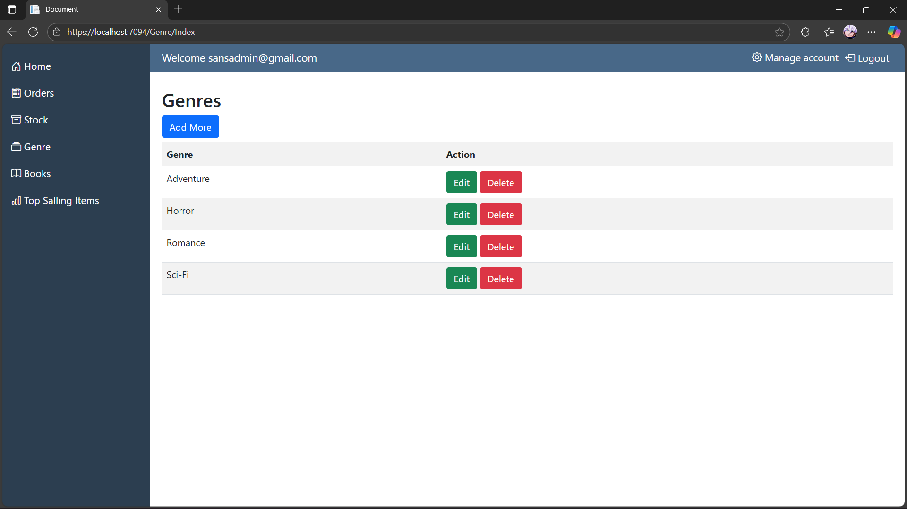

# BookShop (A basic e-comm system )📚🛒

A basic e-commerce source project from a YouTube tutorial — Build a Full E-commerce Application Using .NET Core 9, SQL Server, MVC.
This is a simple online book store built with .NET 9 and intended to be a learning/demo project

## Tech stack 🧑‍💻

   - Dotnet core mvc (.Net 9)
   - MS SQLServer 2022 (Database)
   - Entity Framework Core (ORM)
   - Identity Core (Authentication)
   - Bootstrap 5 (frontend)

## Tools I have used and their alternative

- Visual Studio 2022 (Alternatives : .NET SDK + VS Code or .NET SDK ).
- Microsoft Sql Server Management Studio (Alternative : mssql extension for vscode / dbeaver).
- Instead of manually installing `sql server`, you can also used `sql server` which is spun up in `docker`.

## Screenshots

1.Homepage

2.Homepage continued

3.Login

4.Registration

5.Add To Cart

6.Cart

7.Checkout

8.Order success

9.Admin Login

10.Admin Dashboard

11.Orders

12.Order Detail

13.Update Order Status

14.Display Stock

15.Update Stock

16.Display Genre

17.Add Genre

18.Update Genre

19.Display Books

20.Add Book

21.Update Book

